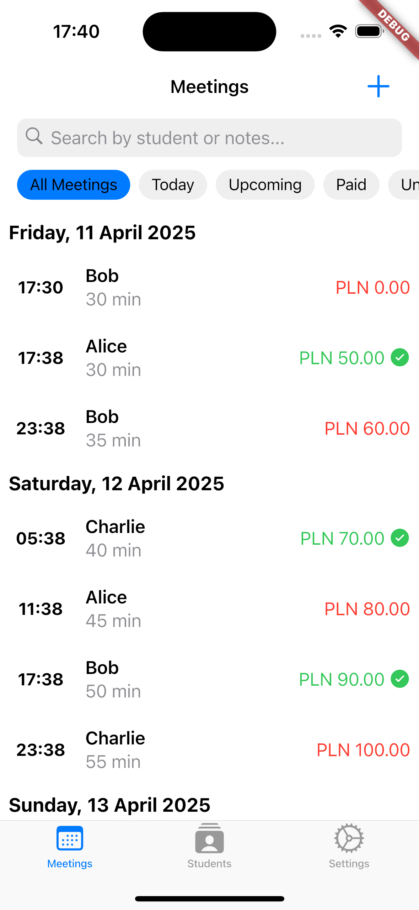
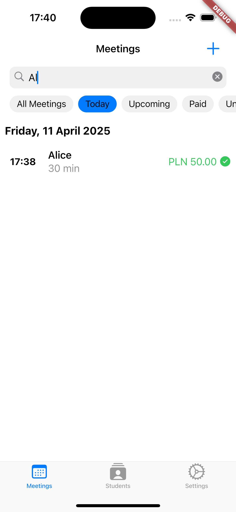
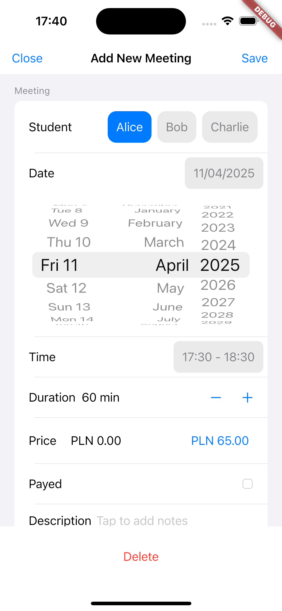
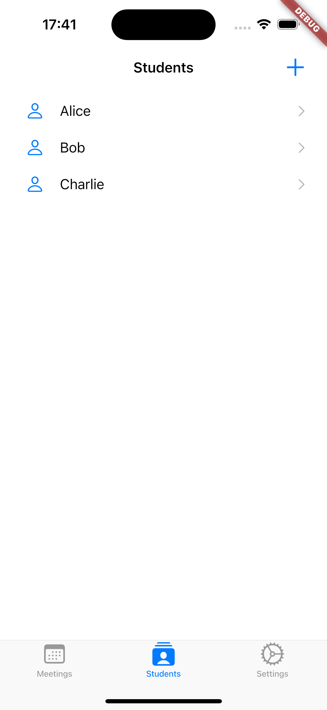
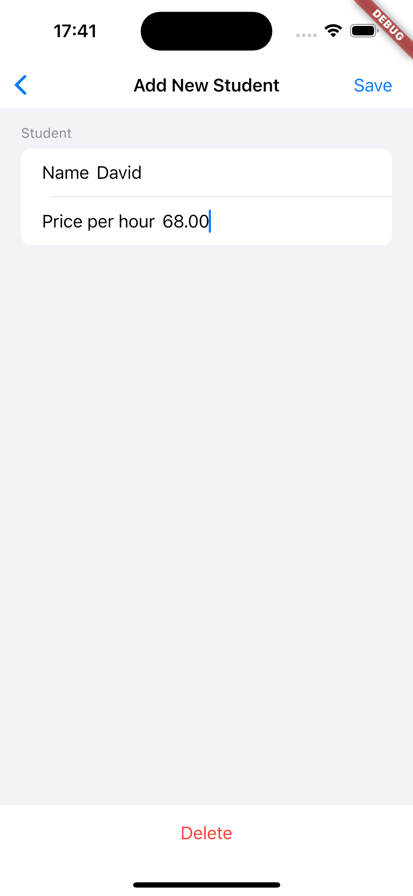
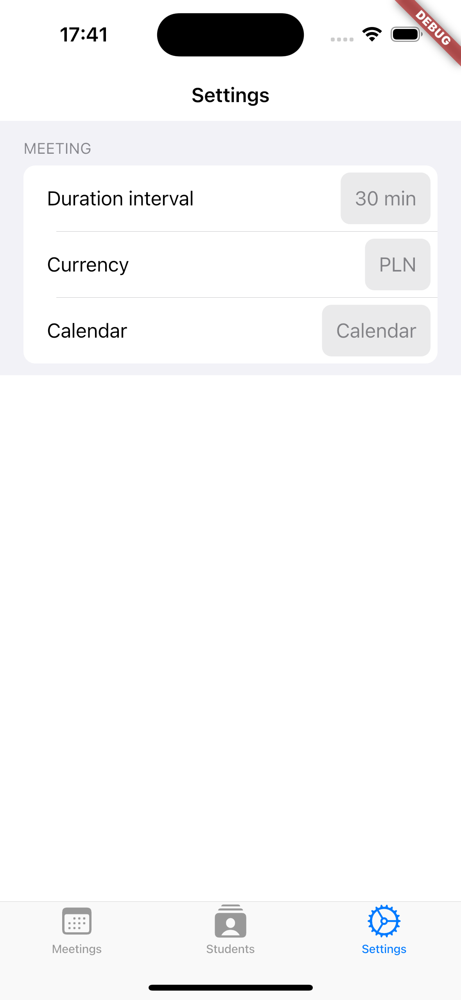

# TutMan

**TutMan** is a Flutter app created primarily for iOS devices (Android also supported). The app is designed to help with **Tutoring Management**.

## Functionalities

### Student Management:
- Add, edit, and store student details  
- Track payment rates (e.g., per hour)  
- Quick access to student profiles  

### Meeting Scheduling & Tracking:
- Schedule tutoring sessions with date/time selection  
- Set meeting duration with adjustable intervals  
- View upcoming and past meetings in a structured list  
- Uses dynamic data fetching to check if the date is a Polish holiday  

### Calendar Integration:
- Automatically add meetings to the device's calendar  
- Sync with iOS Calendar & Google Calendar (Android)  

### Payment Tracking:
- Mark meetings as paid/unpaid  
- Calculate session costs based on hourly rates  
- Support for multiple currencies (exchange rate functionality not included)  

### Search & Filtering:
- Search meetings by student name or description  
- Filter by:
  - Today's meetings  
  - Upcoming sessions  
  - Paid/Unpaid status  

## Platform Support:
- Optimized for iOS (Cupertino design language)  
- Fully functional on Android (Material design adaptations)  

## Technical Details:
- Built with Flutter (Dart)  
- Uses SQLite (`sqflite`) for local storage  
- Device Calendar API for event synchronization  
- Provider for state management  
- Cupertino widgets for iOS-native UI  

# Running TutMan

It is **highly recommended** to use macOS to run the app on a simulator.

## Prerequisites
To run the app on an iOS or Android simulator:

- Flutter SDK installed (latest stable version)  
  → Follow the instructions: [Flutter Installation](https://docs.flutter.dev/get-started/install)
- Xcode (for iOS) – only available on macOS via App Store  
  - iOS Simulator: [How to install](https://developer.apple.com/documentation/xcode/downloading-and-installing-additional-xcode-components)
- Android Studio (for Android): [Download Android Studio](https://developer.android.com/studio)  
  - Android Emulator/Simulator  

### To run the app on a simulator:

```bash
git clone https://github.com/Haltie13/tut_man.git
cd tutman
flutter pub get
flutter run
```
Follow Flutter instructions if you encounter any setup issues.
Example meetings will appear after adding one custom one.

<p align="center">
  
  
  
</p>
<p align="center">
  
  
  
</p>


